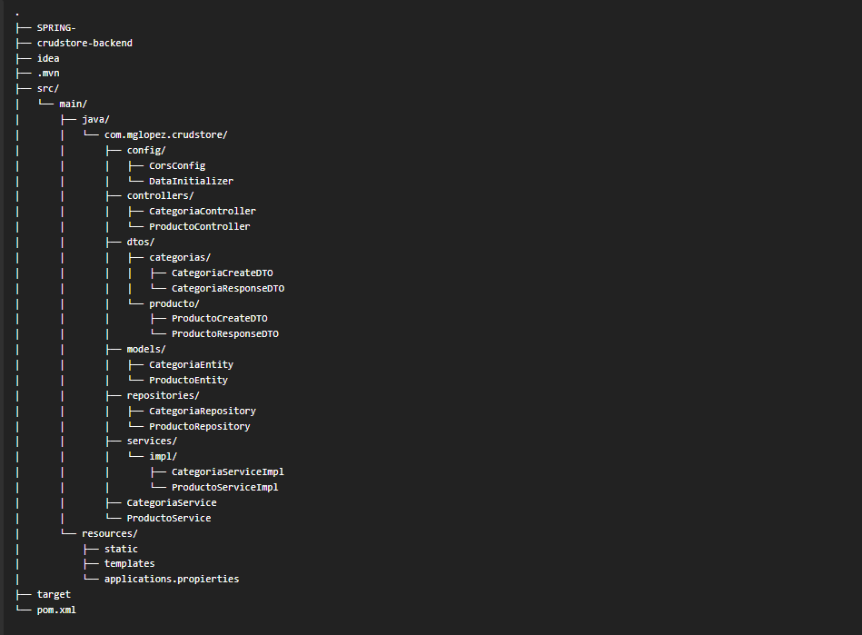
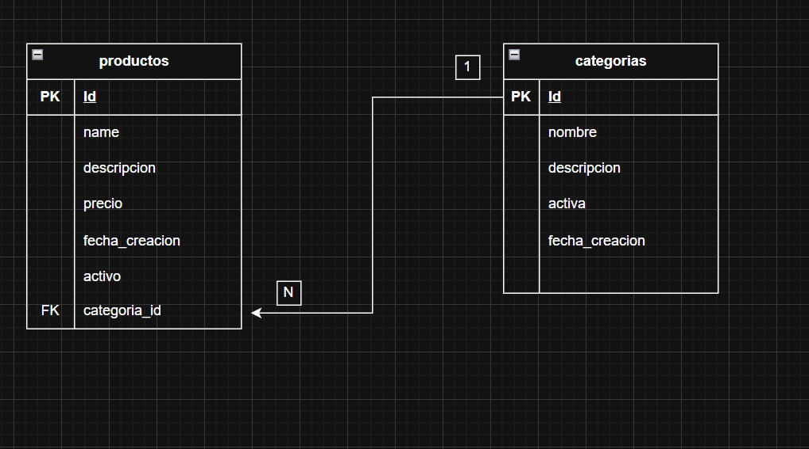

# 📦 CrudStore Backend

## 📖 Simulación de E-commerce profesional
**CrudStore Backend** es una API REST desarrollada con **Spring Boot** que simula el backend de una tienda online.  
Permite la gestión de **categorías** y **productos**, implementando operaciones CRUD completas con **persistencia en PostgreSQL**, validaciones, desactivación lógica y una arquitectura limpia basada en buenas prácticas.  

El backend está diseñado para ser consumido por un **frontend Angular** (documentado por separado).

---

## 🛠️ Stack Tecnológico

| Tecnología | Versión | Uso |
|-----------|--------|-----|
| Java | 17 | Lenguaje base |
| Spring Boot | 4.0.2 | Framework principal |
| Spring Web MVC | — | API REST |
| Spring Data JPA | — | Persistencia |
| Hibernate | — | ORM |
| PostgreSQL | — | Base de datos |
| Maven | — | Gestión de dependencias |
| Lombok | — | Reducción de boilerplate |
| Jakarta Validation | — | Validación de datos |

---

## 🏗️ Arquitectura

El proyecto sigue una **arquitectura en capas (Layered Architecture)**:


### Capas

**Controller**  
- Exposición de endpoints REST  
- Manejo de HTTP status codes  
- Validación de datos de entrada (`@Valid`)  

**Service**  
- Lógica de negocio  
- Reglas de dominio  
- Transacciones (`@Transactional`)  

**Repository**  
- Acceso a datos mediante Spring Data JPA  

**Model / Entity**  
- Representación del modelo de dominio  

**DTO**  
- Separación entre modelo interno y contratos API  

---

## 📂 Estructura del Proyecto



---

## 🧩 Patrones de Diseño Aplicados

- **DTO Pattern**: `CreateDTO` para entrada / `ResponseDTO` para salida  
- **Repository Pattern**  
- **Service Layer Pattern**  
- **Builder Pattern** (`@Builder` en entidades)  
- **Dependency Injection**: inyección por constructor (mejor práctica)  
- **Soft Delete (Eliminación lógica)**: campos `activo` / `activa`  

---

## 🗄️ Modelo de Datos

### CategoriaEntity
- Relación **OneToMany** con `ProductoEntity`  
- Desactivación lógica (`activa`)  
- Nombre único  

### ProductoEntity
- Relación **ManyToOne** con `CategoriaEntity`  
- Precio con precisión decimal (`BigDecimal`)  
- Eliminación lógica (`activo`)  

📌 **Diagrama Entidad–Relación**



---

## 🔐 Validaciones

Se utilizan **Jakarta Validation**:

- `@NotBlank`  
- `@NotNull`  
- `@Positive`  
- `@Size`  

Ejemplo en Producto:

`java
@NotNull
@Positive
BigDecimal precio;`

~~~
# Base de Datos
spring.datasource.url=jdbc:postgresql://localhost:5432/crudstore_db
spring.datasource.username=postgres
spring.datasource.password=1234

# JPA / Hibernate
spring.datasource.driver-class-name=org.postgresql.Driver
spring.jpa.hibernate.ddl-auto=create
spring.jpa.show-sql=true
spring.jpa.properties.hibernate.format_sql=true

# ⚠️ En producción se recomienda usar: ddl-auto=validate
~~~


🌐 CORS
~~~
Configurado para permitir acceso desde Angular:

.allowedOrigins("http://localhost:4200")
.allowedMethods("GET", "POST", "PUT", "DELETE")


▶️ Ejecución del Proyecto

mvn clean install
mvn spring-boot:run

~~~

Servidor: http://localhost:9525

📡 Endpoints Principales

Categorías
| Método | Endpoint             | Descripción        |
| ------ | -------------------- | ------------------ |
| POST   | /api/categorias      | Crear categoría    |
| GET    | /api/categorias      | Listar activas     |
| GET    | /api/categorias/{id} | Obtener por ID     |
| PUT    | /api/categorias/{id} | Actualizar         |
| DELETE | /api/categorias/{id} | Eliminación lógica |

Productos
| Método | Endpoint                      | Descripción        |
| ------ | ----------------------------- | ------------------ |
| POST   | /api/productos                | Crear producto     |
| GET    | /api/productos                | Listar activos     |
| GET    | /api/productos/{id}           | Obtener por ID     |
| GET    | /api/productos/categoria/{id} | Por categoría      |
| PUT    | /api/productos/{id}           | Actualizar         |
| DELETE | /api/productos/{id}           | Eliminación lógica |

🧪 Inicialización de Datos
Se utiliza CommandLineRunner para cargar datos de prueba al iniciar la aplicación:

Categorías iniciales

Productos asociados

Ideal para entorno de desarrollo.

🚀 Buenas Prácticas Implementadas

✅ Separación de capas
✅ DTOs para evitar exponer entidades
✅ Eliminación lógica
✅ Inyección por constructor
✅ Validaciones centralizadas
✅ Uso de transacciones
✅ Código limpio y legible


# Crudstore Frontend

Frontend de una aplicación **CRUD de Categorías y Productos**, desarrollada con **Angular 21**, **Angular Material** y arquitectura **standalone components**. Este proyecto consume una API REST para la gestión de una tienda (store) y está pensado como ejemplo profesional y escalable.

---

## 🧩 Tecnologías utilizadas

* **Angular 21** (standalone components)
* **Angular Material** (UI / UX)
* **RxJS** (manejo de streams y asincronía)
* **TypeScript**
* **Reactive Forms**
* **Angular Router + Resolvers**
* **HTTP Client**

---

## 📁 Estructura del proyecto

```bash
├── public/
│   └── favicon.ico
├── src/
│   ├── app/
│   │   ├── core/
│   │   │   └── http/              # (Reservado para interceptores, config global HTTP)
│   │   ├── features/
│   │   │   ├── categorias/
│   │   │   │   ├── components/
│   │   │   │   │   ├── categoria-list/
│   │   │   │   │   └── categoria-form/
│   │   │   │   ├── models/
│   │   │   │   └── services/
│   │   │   ├── productos/
│   │   │   │   ├── components/
│   │   │   │   │   ├── producto-list/
│   │   │   │   │   └── producto-form/
│   │   │   │   ├── models/
│   │   │   │   └── services/
│   │   ├── shared/                # Componentes reutilizables (futuro)
│   │   ├── app.component.*
│   │   ├── app.routes.ts
│   │   └── app.config.ts
│   ├── index.html
│   ├── main.ts
│   └── styles.scss
├── angular.json
├── package.json
└── README.md
```

---

## 🚀 Arranque del proyecto

### 1️⃣ Instalar dependencias

```bash
npm install
```

### 2️⃣ Ejecutar en desarrollo

```bash
npm start
```

La aplicación estará disponible en:

```
http://localhost:4200
```

---

## 🔌 Backend esperado

El frontend consume una API REST disponible en:

* **Categorías:** `http://localhost:9525/api/categorias`
* **Productos:** `http://localhost:9525/api/productos`

> ⚠️ El backend debe estar levantado previamente.

---

## 🧠 Arquitectura general

* **Standalone Components:** no se usan NgModules.
* **Feature-based architecture:** cada dominio (categorías, productos) es independiente.
* **Resolvers:** los datos se cargan antes de renderizar las vistas.
* **Servicios:** encapsulan la lógica de comunicación HTTP.
* **Modelos / DTOs:** tipado fuerte entre frontend y backend.

---

## 🧭 Bootstrap de la aplicación

### `main.ts`

Responsable de arrancar la aplicación usando `bootstrapApplication`:

* Carga `AppComponent`
* Aplica configuración global (`appConfig`)

### `app.config.ts`

Configura los providers globales:

* Router
* HttpClient
* Animaciones

---

## 🧩 Componente raíz

### `AppComponent`

* Toolbar principal con navegación
* `router-outlet` para renderizar vistas

Incluye:

* Angular Material Toolbar
* Botones de navegación a Categorías y Productos

---

## 🗺️ Rutas de la aplicación

Definidas en `app.routes.ts`:

```ts
/
/categorias
/categorias/nueva
/categorias/editar/:id
/productos
/productos/nuevo
/productos/editar/:id
```

### Resolvers

* **CategoriaResolver**: precarga categorías
* **ProductoResolver**: precarga productos

Evitan pantallas vacías y mejoran UX.

---

## 🏷️ Módulo de Categorías

### Modelo

```ts
export interface Categoria {
  id: number;
  nombre: string;
  descripcion: string;
  activa: boolean;
  fechaCreacion: string;
}
```

### Servicio `CategoriaService`

Responsabilidades:

* Listar categorías
* Obtener por ID
* Crear
* Actualizar
* Eliminar

Incluye:

* Timeout
* Retry
* Manejo de errores

### Listado de categorías

`CategoriaListComponent`

* Usa `MatTable`
* Datos cargados por resolver
* Eliminación directa

### Formulario de categorías

`CategoriaFormComponent`

* Reactive Forms
* Validaciones
* Reutilizado para crear y editar

---

## 📦 Módulo de Productos

### Modelos

```ts
export interface Producto {
  id: number;
  name: string;
  descripcion: string;
  precio: number;
  activo: boolean;
  categoriaId: number;
  categoriaNombre: string;
  fechaCreacion: string;
}

export interface ProductoCreateDTO {
  name: string;
  descripcion: string;
  precio: number;
  categoriaId: number;
}
```

### Servicio `ProductoService`

Funciones:

* CRUD completo
* Listar por categoría (opcional)
* Manejo avanzado de errores

### Listado de productos

`ProductoListComponent`

* Tabla con columnas:

  * Nombre
  * Descripción
  * Precio
  * Categoría
  * Estado
  * Acciones

### Formulario de productos

`ProductoFormComponent`

* Reactive Forms
* Carga dinámica de categorías
* Soporte crear / editar
* Validaciones de negocio

---

## 🎨 UI / UX

* Angular Material
* Diseño limpio y responsive
* Feedback visual:

  * Loading spinners
  * Confirmaciones
  * Alertas

---

## ✅ Buenas prácticas aplicadas

* Tipado estricto
* Separación de responsabilidades
* Código reutilizable
* Manejo de errores
* Arquitectura escalable

---

## 📌 Mejoras futuras

* Autenticación / Autorización
* Interceptores HTTP
* Guards de rutas
* Paginación y filtros
* Testing unitario
* Variables de entorno

---

## 👨‍💻 Autor

Proyecto desarrollado como ejemplo profesional de **frontend Angular moderno**.

---

## 📄 Licencia

Este proyecto es de uso libre para fines educativos y demostrativos.


